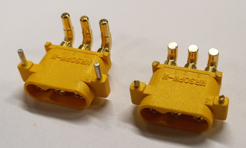

# MVSC2 - MV Stepper Controller V2 

Stepper controller using a STM32F411CEU6 and 6x TMC2208-LA-T.  
Intended as a 3D printer controller, or a standalone 6 stepper driver.  
Also has 6 connectors for endstops or servos.  
Includes design with magnetic proximity sensors as endstops using CH912LSR.  

Design files ready for production at JLCPCB (except connectors, TODO).  

NOTE:  
- In the design I use a lower current setting for the stepper driver, which is meant for weaker steppers. Change sense resistor for normal stepper.  
- It is mean to be attached to a 2040 V slot profile, for cooling.  
- Since fabricating this, JLCPCB now supports connectors so this should be updated (hand soldering a USBC is not fun).  
- The power connector requires hand modification: the leads should be shortened such, and the support pins as well as not to portrude from the other side. Apply superglue for extra strength.  
- A compatible Marlin configuration to be added at a later date.

  

